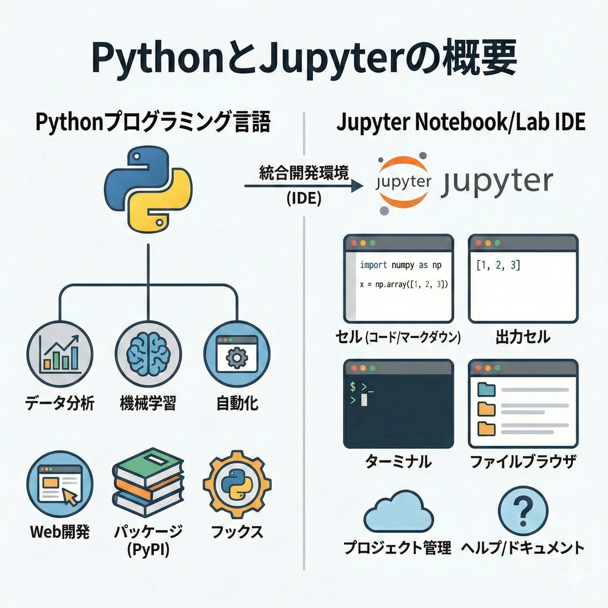

# 第1回 PythonとJupyter（/VS Code）の基礎 {.unnumbered}



## なぜ今、Pythonを学ぶのか

統計解析ソフトは山ほどあります。Excelで事足りることもあれば、Pythonがハマる場面もあるでしょう。それでも、多くの研究者が **Python** を選び続けるのには理由があります。

「科学的な正しさ」への執着。これに尽きます。

本講義の狙いは、単なるツールの操作説明ではありません。**Python** による「再現性（Reproducibility）」の思想を理解し、**Jupyter（またはVS Code）** を通じてそれを実践する力を養うことです。

### 科学的検証のためのツール

なぜこれほどPythonを推すのか。最大の理由は **再現性が確保できるから** です。
Excelでの分析は、どうしても「手作業」の連続になります。どのセルをコピーし、どこでフィルタをかけ、どのグラフを選んだか。その履歴を完全に追跡するのは困難です。
一方、Pythonはすべての操作をコードとして残します。コードは「手順書」そのもの。第三者が同じコードを実行すれば、間違いなく同じ結果が出ます。科学的な検証において、この特性は欠かせません。

もちろん、実利的なメリットも大きいです。

- **OSSとコスト**: 個人・組織を問わず無料（GPLライセンス）。
- **ライブラリの豊富さ**: 数値計算（NumPy）、データ操作（pandas）、可視化（matplotlib / seaborn）、統計モデリング（statsmodels）などが揃っています。
- **キャリア**: データ分析・データサイエンスの職務記述書（JD）でPythonは定番スキルです。

（Webアプリ開発やシステムへの組み込みならPythonやC++が適しています。適材適所です）

### PythonとExcel：対立ではなく使い分け

よく「RかExcelか」と二項対立で語られますが、実際は「併用」が正解です。

| ツール | 得意な領域 | 苦手な領域 |
|---|---|---|
| **Excel** | 直感的な操作、データの閲覧、小規模な集計 | 大規模データ（100万行〜）、手順の記録、複雑な統計モデル |
| **Python** | 大規模データの処理、高度な統計解析、再現性のある描画 | データの直接入力、閲覧（スプレッドシート的な操作） |

私だって、データの概観やちょっとした検算にはExcelを使います。でも、論文に載せる分析や、来月も同じ処理をする業務なら、迷わずPythonを選びます。

## Jupyter（/VS Code）という「コックピット」

Python本体はただの「計算エンジン」です。人間が楽に扱うために、ノートブック環境の **Jupyter**（または統合開発環境のVS Code）を使います。
画面は4分割されていますが、データの流れで考えると分かりやすいでしょう。

1.  **Editor / Notebook**：ここで「指示書（コード）」を書く。
    -   料理ならレシピを書く場所。ここに書いたものだけが「再現可能な記録」として残ります。
2.  **実行結果（セル出力 / Terminal）**：指示を実行し、結果を受け取る。
    -   実際にPythonが計算する場所。ちょっとした確認用です。
3.  **変数/データの確認**：データフレームや変数を確認する。
    -   いまメモリ上に何があるかを把握します。
4.  **Plots / Files**：グラフやファイルを確認する。
    -   描かれた図や保存物はここで見ます。

基本は、「左上で書いて、左下で実行させて、右と右下で結果を確認する」。この繰り返しです。

## Pythonと対話する（計算と変数）

まずは難しく考えず、Pythonを「やたら高機能な電卓」として使ってみましょう。
セル（またはREPL）に直接入力してみてください。

```{python}
1 + 1
(100 - 20) / 4
```

### 情報を箱に入れる：変数

計算結果を使い捨てにせず、取っておくための箱が **変数（オブジェクト）** です。
Pythonでは `=`（代入）を使います。「右の値を左の箱に入れる」イメージです。

```{python}
price = 1500
amount = 3
total = price * amount
total
```

大事なのは、`price` や `amount` という「名前」でデータを管理できること。「1500」という数値の意味を、人間が覚えておく必要はありません。

### 便利な道具：関数

よく使う処理は **関数** として用意されています。「機能名(データ)」の形で呼び出します。

```{python}
import statistics as stats

# 数値のリスト（列）を作る
scores = [80, 90, 75, 60, 95]

# 平均値を計算する
stats.mean(scores)
```

関数は無数にありますが、最初は「やりたいこと（機能）」と「入れるもの（引数）」の対応さえ意識できれば十分です。

## 「エラー」はPythonからの返信

プログラミング初心者にとって、赤い文字のエラーメッセージは怖いかもしれません。「お前は間違ってる」と怒られた気分になるからでしょう。
でも、誤解です。エラーはPythonからの「この指示だと、ここが分からなくて実行できません」という、ただの返信です。

-   **`NameError`**：「その名前が見当たりません」（変数を作る前に使っていませんか？）
-   **`ModuleNotFoundError`**：「そのライブラリが見つかりません」（インストールし忘れていませんか？）

エラーが出たら、まずはメッセージを読んでみてください。解決のヒントは必ずそこにあります。

## グラフを描いてみる

最後に、Pythonの「華」、可視化を試してみます。
解説は省きますが、数行書くだけで美しい散布図が描けることを確認してください。

```{python}
import pandas as pd
import seaborn as sns
import matplotlib.pyplot as plt
import japanize_matplotlib  # noqa: F401

url = "https://raw.githubusercontent.com/mwaskom/seaborn-data/master/tips.csv"
tips = pd.read_csv(url)

ax = sns.scatterplot(data=tips, x="total_bill", y="tip")
ax.set(title="支払総額とチップ", xlabel="支払総額 ($)", ylabel="チップ ($)")
plt.show()
```

このグラフも、コードの数値を少し変えるだけで、明日になっても（あるいは10年後でも）全く同じものを再現できます。

## 課題

1.  自身の年齢を変数 `age` に代入してください。
2.  変数 `age` を使って、10年後の年齢を計算してください。
3.  任意の数値を3つ格納したリストを作成し、その平均値を求めてください。
