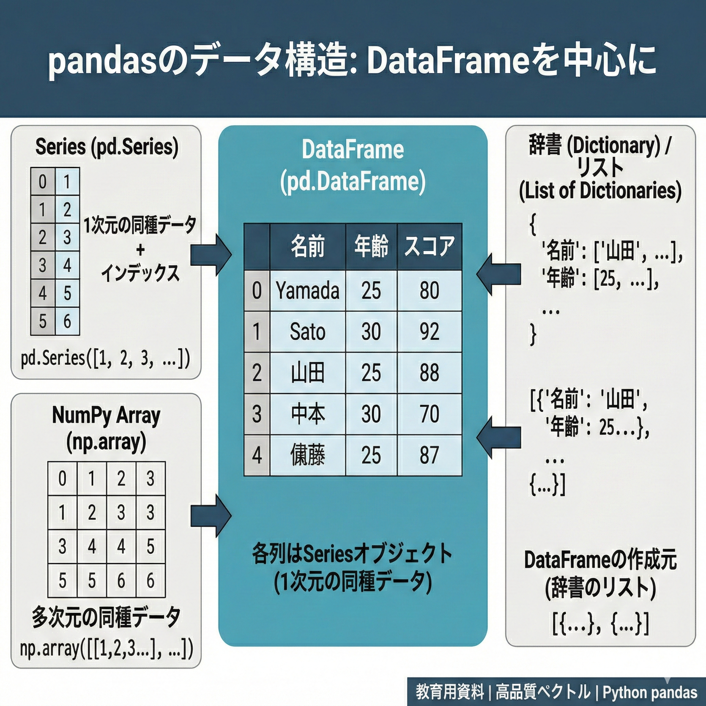

# 第2回 データの構造と扱い {.unnumbered}



## データを「整える」思想

データ分析において、一番時間を食う作業は何でしょうか。複雑な統計モデルの構築ではありません。「データの掃除（Data Wrangling）」です。
形式の揃っていないデータ、謎の空白、表記の揺れ。これらを人間が扱える形に整えるだけで、プロジェクトの時間の8割が消えることすらあります。

本節では、この泥臭い作業をエレガントに片付ける武器、**pandas** を導入します。

### pandas：人間中心のPython

Pythonにもデータを扱う手段は色々ありますが、表形式データ（行と列）を扱うなら **pandas** が事実上の標準です。
「人間が読みやすく、書きやすい」ことを優先しつつ、現実のデータ分析に必要な機能が一通り揃っています。

1.  **インストール（世界への入り口）**：初回のみ
    ```{bash}
    pip install pandas
    ```
2.  **ロード（道具箱を開ける）**：起動するたびに必要
    ```{python}
    import pandas as pd
    ```

これだけで、必要な道具一式（加工、可視化、読み込み...）は揃います。

## データフレーム：世界を表にする

現実のデータは、混沌としています。それをコンピュータが理解できる形は、結局「行と列」だけです。
Python（pandas）での呼び名も **データフレーム** です。

-   **行（Row）**：ひとつの観測単位（1人の人間、1回の取引、1日の記録）
-   **列（Column）**：属性や変数（年齢、金額、気温）

### 現実をPythonに取り込む（CSV読み込み）

手元のExcelやCSVファイルは、まだ「外」にあります。これを「中」（Pythonの計算世界）に引き入れる儀式が `read_csv()` です。

今回は、Pythonのライブラリ等でもよく使われる `tips`（レストランのチップ支払い記録）をWebから直接読み込んでみます。

```{python}
import pandas as pd

url = "https://raw.githubusercontent.com/mwaskom/seaborn-data/master/tips.csv"
tips = pd.read_csv(url)

# データの「顔見せ」
tips.info()
tips.head()
```

読み込んだ瞬間、変数の型（数値なのか、文字なのか）は自動判定されます。Excelによくある「数字なのに文字扱い」みたいなトラブルも、入り口で防げます。

## データ操作の文法（pandas）

pandasには、データ加工の基本操作が一通り揃っています。
「列を選ぶ」「行を絞る」「新しい列を作る」「並べ替える」「グループ集計する」――これらがデータ分析の基本動作です。

### つなげて書く：メソッドチェーン

pandasでは「メソッドチェーン（メソッドを連結して書く）」で、思考の順番に処理を書けます。

-   **単発**: `tips[["total_bill"]].head()` → 「列を選んで、先頭を見る」
-   **連結**: `tips.query('time == "Dinner"').sort_values("tip", ascending=False).head()` → 「絞って、並べて、先頭を見る」

### 1. 切り分ける：列の選択と行の抽出

分析はまず、要らない部分を削ぎ落とすことから始まります。

**列（変数）を選ぶ**
「分析に性別と喫煙情報は関係ない」なら、こう。

```{python}
tips[["total_bill", "tip"]].head()
```

**行（観測）を絞る**
「ディナーの客だけ見たい」なら、こう。

```{python}
tips.query('time == "Dinner"').head()
```

### 2. 加工する：新しい列を作る

既存の列を使って新しい指標を作るときは `assign()` が便利です。
「チップの額」そのものより、「支払額に対するチップの割合」の方が意味があるでしょう。

```{python}
(
  tips
  .assign(tip_rate=lambda df: df["tip"] / df["total_bill"])
  .loc[:, ["total_bill", "tip", "tip_rate"]]
  .head()
)
```

### 3. 並べる：並べ替え

データは最初、「記録順」です。これを「意味のある順」に変えます。

```{python}
# チップを多く払った順（降順）に並べる
tips.sort_values("tip", ascending=False).head()
```

### 4. 要約する：グループ集計

個別の値より「傾向」が知りたいなら、グループにまとめて（`groupby`）、縮約（`agg`）します。
「ランチとディナー、どっちが羽振りがいいのか？」という問いに答えてみましょう。

```{python}
(
  tips
  .groupby("time", as_index=False)
  .agg(
    平均支払額=("total_bill", "mean"),
    平均チップ=("tip", "mean"),
    データ数=("tip", "size"),
  )
)
```

## ストーリーで書く

これらの「動詞」と「パイプ」を組み合わせれば、複雑なデータ処理も一つのストーリーとして記述できます。

> **問い**：土曜日のディナーに来た客のうち、特にチップを弾んでくれた（総額の20%以上）のはどんな人たちか？支払額が高い順に見たい。

この思考プロセスをそのままコードにします。

```{python}
(
  tips
  .query('day == "Sat" and time == "Dinner"')                       # 土曜日のディナー客で
  .assign(rate=lambda df: df["tip"] / df["total_bill"])              # チップ率を計算し
  .query("rate >= 0.2")                                              # 20%以上に絞り込み
  .sort_values("total_bill", ascending=False)                        # 支払額が高い順に並べる
  .loc[:, ["sex", "size", "total_bill", "tip", "rate"]]              # 必要な情報だけ見る
)
```

この「読みやすさ」こそ、私たちがpandas（メソッドチェーン）を使う理由です。数ヶ月後の自分が見ても、「何がしたかったか」一目で分かります。

## データ操作の補足事項

### 列の選び方
pandasにも「取り出し方の違い」があります。

- `tips["total_bill"]`：1本の列（Series）として取り出す。計算式の内部で使うことが多い。
- `tips[["total_bill"]]`：データフレームのまま取り出す。加工を続けるときに便利。
使い分けですが、複数列を扱う処理では `tips[["col1", "col2"]]` の形が無難です。

### データのチラ見（可視化）
数字だけだと見逃します。`seaborn` でサッと可視化する癖をつけてください。

```{python}
import seaborn as sns
import matplotlib.pyplot as plt
import japanize_matplotlib  # noqa: F401

ax = sns.scatterplot(data=tips, x="total_bill", y="tip", hue="time")
ax.set(xlabel="支払総額 ($)", ylabel="チップ ($)")
plt.show()
```

## 課題
自分でストーリーを作ってみましょう。

1.  `day` が "Sun"（日曜日）である行のみを抽出する（`filter`）。
2.  抽出したデータから、`total_bill` と `size` の2列のみを選択して表示する（`select`）。

## 練習問題

正解かどうかより、「コードが思考の流れを表しているか」を意識してください。

### 練習1: 基礎確認
`glimpse()` や `dim()` を使い、このデータセットが「何行何列」で、「変数の型は何か」を言葉で説明してください。

### 練習2: 仮説の検証
「女性客の方がチップ率が高いのではないか？」という仮説を検証するコードを書いてください。（ヒント：`filter`で女性を抽出し、`mutate`で率を計算し、`summarize`で平均を出す、など方法は幾通りもあります）

### 練習3: パイプラインの構築
以下の処理をひとつのパイプラインで書いてみてください。

1. 土曜日 (`Sat`) のデータを抽出。
2. チップ率を計算し、新しい列として追加。
3. そのチップ率が高い順（降順）に並べ替え。
4. 上位5件を表示。
