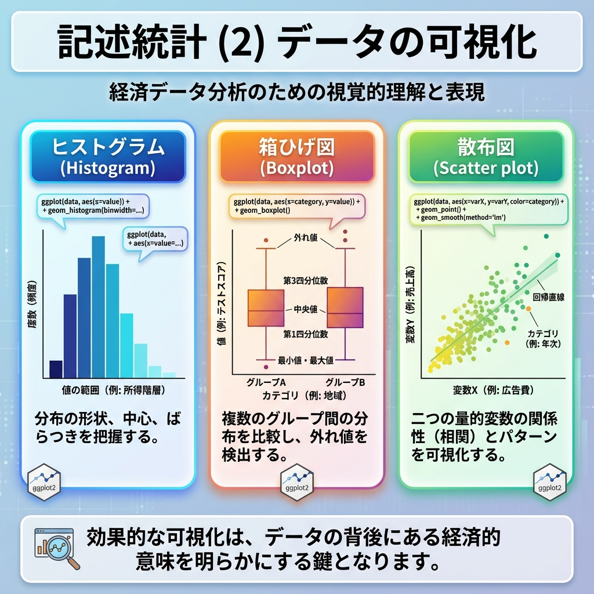

# 第4回 記述統計 (2) データの可視化 {.unnumbered}



## 要約の限界と「アンスコムの警鐘」

前節では、膨大なデータを「平均値」や「分散」などの数値に縮約し、全体の特徴を掴みました。
しかし、縮約には副作用があります。「形の消失」です。

Anscombe (1973) の有名な例、アンスコムのカルテットを見てみましょう。
一見、平均値も分散も相関係数もしっかり一致している4つのデータセットです。

```{python}
import pandas as pd
import seaborn as sns

# seabornに用意されている anscombe（アンスコムのカルテット）
anscombe = sns.load_dataset("anscombe")  # columns: dataset, x, y

stats = (
  anscombe
  .groupby("dataset")
  .agg(
    mean_x=("x", "mean"),
    mean_y=("y", "mean"),
    sd_x=("x", "std"),
    sd_y=("y", "std"),
  )
)
stats["cor"] = anscombe.groupby("dataset").apply(lambda g: g["x"].corr(g["y"]))
stats
```

数値だけなら「これらは同じ性質のデータだ」と結論づけてしまうでしょう。でも、グラフにして可視化した瞬間、景色は一変します。
[対象注意: 日本語フォント設定は環境依存あり]

```{python}
import matplotlib.pyplot as plt
import japanize_matplotlib  # noqa: F401

g = sns.lmplot(
  data=anscombe,
  x="x",
  y="y",
  col="dataset",
  ci=None,
  height=3,
  scatter_kws={"s": 35, "alpha": 0.9},
  line_kws={"color": "red"},
)
g.set_axis_labels("x", "y")
g.fig.suptitle("数値は嘘をつかないが、真実を語るとは限らない")
g.fig.tight_layout()
plt.show()
```

きれいな直線、曲線、外れ値の影響...。数値要約で捨て去られた情報が、可視化ではっきりと浮かび上がりました。
データ分析において、可視化は分析の「後」の飾りではありません。分析の「最初」に行うべき、欠かせない診断です。

## 準備

本節でも `tips` データセット（Bryant & Smith, 1995）を使います。

```{python}
url = "https://raw.githubusercontent.com/mwaskom/seaborn-data/master/tips.csv"
import pandas as pd

tips = pd.read_csv(url)
```

## キャンバスに層を重ねる：seaborn / matplotlibの考え方

Pythonの可視化では、**seaborn**（統計可視化）と **matplotlib**（土台）が定番です。
Excelみたいに「棒グラフを作るボタン」があるわけではありません。

> 「データ」という土台に、「座標」を定義し、「点や棒（Geom）」を乗せ、「説明（Labels）」を加える。

この工程をコードで書きます。

```{python}
#| eval: false
import seaborn as sns
import matplotlib.pyplot as plt

ax = sns.scatterplot(data=tips, x="total_bill", y="tip")  # キャンバスと座標＋点
plt.show()
```

## 1. 分布の形状を見る

まずは、データが「どんな形」をしているか確認します。

### 山の形を知る：ヒストグラム

連続した数値データ（金額など）が、どこに集まっているかを見に行きます。
山は一つか、二つか？ 左右対称か、歪んでいるか？

```{python}
import seaborn as sns
import matplotlib.pyplot as plt
import japanize_matplotlib  # noqa: F401

ax = sns.histplot(data=tips, x="total_bill", bins=30, color="skyblue", edgecolor="white")
ax.set(title="支払総額の分布", xlabel="支払総額 ($)", ylabel="度数")
plt.show()
```

### 構造を要約する：箱ひげ図

ヒストグラムは詳細ですが、複数のグループ比較には不向きです。重なって見づらいから。
そこで**箱ひげ図**の出番です。分布の情報を「箱」と「ひげ」に要約します。

```{python}
import seaborn as sns
import matplotlib.pyplot as plt
import japanize_matplotlib  # noqa: F401

order = ["Thur", "Fri", "Sat", "Sun"]
ax = sns.boxplot(data=tips, x="day", y="total_bill", order=order)
ax.set(title="曜日ごとの支払額の違い", xlabel="曜日", ylabel="支払総額 ($)")
plt.show()
```

**Tukeyの箱ひげ図の定義**:

-   **箱**: データの中央50%（第1四分位数〜第3四分位数）。この中に「普通」のデータが入ります。
-   **太線**: 中央値（Median）。
-   **点**: 箱から `1.5倍の四分位範囲` 以上離れた値。統計的な「外れ値候補」として扱います。

### 分布の機微を見る：バイオリンプロット

箱ひげ図だと「山が2つある」などの情報は消えてしまいます。分布の形状（密度）そのものを表示したい場合は、バイオリン図を使います。

```{python}
import seaborn as sns
import matplotlib.pyplot as plt
import japanize_matplotlib  # noqa: F401

order = ["Thur", "Fri", "Sat", "Sun"]
ax = sns.violinplot(data=tips, x="day", y="total_bill", order=order, inner=None)
sns.boxplot(data=tips, x="day", y="total_bill", order=order, width=0.2, color="white", ax=ax)
ax.set(title="分布の形状比較（バイオリン+箱ひげ）", xlabel="曜日", ylabel="支払総額 ($)")
plt.show()
```

## 2. 関係性を探る

次は、2つの変数がどう関わっているかを探ります。

### 2つの量の相関：散布図

「たくさん食べた人は、たくさんチップを払うのか？」
2つの連続変数（横軸と縦軸）の関係をプロットします。

```{python}
import seaborn as sns
import matplotlib.pyplot as plt
import japanize_matplotlib  # noqa: F401

ax = sns.scatterplot(data=tips, x="total_bill", y="tip", color="blue", alpha=0.5)
ax.set(title="支払総額とチップの正の相関", xlabel="支払総額 ($)", ylabel="チップ ($)")
plt.show()
```

ここに第3の次元（情報）を加えるのも簡単です。例えば、性別によって色を変えます（`color = sex`）。

```{python}
import seaborn as sns
import matplotlib.pyplot as plt
import japanize_matplotlib  # noqa: F401

ax = sns.scatterplot(data=tips, x="total_bill", y="tip", hue="sex")
ax.set(xlabel="支払総額 ($)", ylabel="チップ ($)")
plt.show()
```

### 状況ごとの違い：ファセット分割

色分け（color）は便利ですが、情報が増えすぎると「スパゲッティ」のように絡まって読めなくなる。
そんなときは `facet_wrap()` でグラフ自体を分割してしまいましょう。

```{python}
import seaborn as sns
import matplotlib.pyplot as plt
import japanize_matplotlib  # noqa: F401

g = sns.relplot(
  data=tips,
  x="total_bill",
  y="tip",
  hue="smoker",
  col="time",
  kind="scatter",
)
g.set_axis_labels("支払総額 ($)", "チップ ($)")
g.fig.suptitle("条件による関係性の違い")
g.fig.tight_layout()
plt.show()
```

## グラフを「語らせる」ための調整

デフォルトのままでは、グラフは「下書き」です。誰かに伝えるためには、意図が伝わるよう調整します。

### 統計情報の重ね書き
「傾向」を見せたいなら、生のデータ点だけでなく、平均値や回帰直線を重ねるのが効果的です。

```{python}
import seaborn as sns
import matplotlib.pyplot as plt
import japanize_matplotlib  # noqa: F401

order = ["Thur", "Fri", "Sat", "Sun"]
ax = sns.boxplot(data=tips, x="day", y="total_bill", order=order, color="lightblue")

means = tips.groupby("day")["total_bill"].mean().reindex(order)
xs = range(len(order))
ax.scatter(xs, means.values, color="red", s=60)
ax.plot(xs, means.values, color="red", linestyle="--")

ax.set(title="曜日ごとの傾向（赤点は平均値）", xlabel="曜日", ylabel="支払総額 ($)")
plt.show()
```

### ユニバーサルデザインへの配慮
あなたのグラフを見る人の中には、特定の色が見えにくい人（色覚多様性）がいるかもしれません。
「赤と緑」の色分けだけで情報を伝えてはダメです。形状（`shape`）や線種（`linetype`）の違いを併用するか、誰もが識別しやすいカラーパレット（Viridisなど）の使用をおすすめします。

## 課題
自分の手で可視化を行い、データからの発見を言語化してください。

1.  `tip`（チップ）の分布をヒストグラムで確認してください。何か気づく特徴はありますか？（キリの良い数字が多い、など）
2.  `total_bill` と `tip` の散布図を描き、`time`（ランチ/ディナー）で色分けして、時間帯による傾向の違いを議論してください。

## 練習問題

### 練習1: ヒストグラムの最適化
1. `tip` のヒストグラムを作成してください。
2. ビンの数（`bins`）を10, 30, 50と変えてみてください。分布の印象がどう変わるか観察してください。

### 練習2: 多変量の可視化
1. 性別 (`sex`) ごとの `tip` の分布を箱ひげ図で比較してください。女性の方がばらつきが大きいですか？
2. 喫煙者 (`smoker`) ごとの `total_bill` の分布を、`facet_wrap()` を使って左右に並べて比較してください。

### 練習3: 散布図への情報付加
1. `total_bill` と `tip` の散布図を作成してください。
2. 点の大きさを `size`（人数）にマッピングしてください（`aes(size = size)`）。大人数のグループは右上に集まっていますか？
3. 全体の傾向を示す回帰直線を `geom_smooth()` で追加してください。
