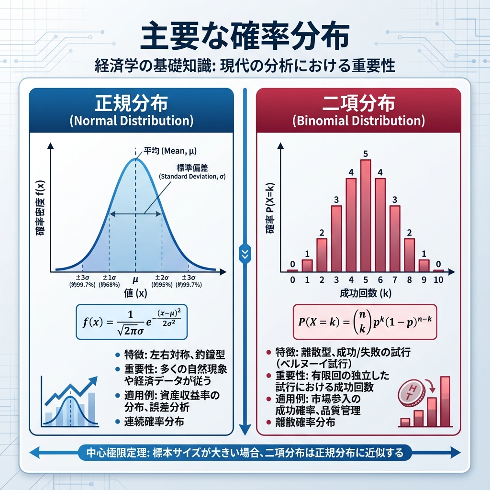

# 第6回 主要な確率分布 {.unnumbered}



## 世界を支配する「釣り鐘」

身長、テストの点数、工場の部品サイズ、株価の変動...。
まったく異なるこれらすべての現象に、どこにでも現れる不思議な曲線があります。
**正規分布（Normal Distribution）**。またの名を、**ガウス分布**。

なぜ世界は、ことあるごとに正規分布したがるのか？
その秘密は、統計学で最強の定理（中心極限定理）にあります。まずはこの「王様」の振る舞いを知ることから始めましょう。

本節では、統計解析の主役である正規分布と、その親戚たち（二項分布、t分布など）を、Pythonを使って自在に操れるようになります。

## 1. 統計学の王様：正規分布

正規分布は、平均 $\mu$ と分散 $\sigma^2$ 。たった2つのパラメータで完全に決まる、左右対称の美しい釣鐘型をしています。

$$f(x) = \frac{1}{\sqrt{2\pi\sigma^2}} \exp\left(-\frac{(x-\mu)^2}{2\sigma^2}\right)$$

数式は複雑に見えますが、Pythonなら一瞬で描けます。

### 4つの基本操作

Pythonでは **SciPy**（`scipy.stats`）を使うのが定番です。確率分布は共通のインターフェースを持ちます。

-   **PDF/PMF**: 密度（連続）/確率（離散）。グラフの高さ。 (`norm.pdf`, `binom.pmf`)
-   **CDF**: 累積確率。ある地点より左側の面積。 (`norm.cdf`)
-   **PPF**: 分位点。確率から値を逆算。 (`norm.ppf`)
-   **RVS**: 乱数生成。シミュレーション用。 (`norm.rvs`)

### 正規分布を描いてみる

まずは標準正規分布（平均0、分散1）を見てみましょう。

```{python}
import numpy as np
import matplotlib.pyplot as plt
from scipy.stats import norm

x = np.linspace(-4, 4, 100)
y = norm.pdf(x, loc=0, scale=1)

plt.plot(x, y)
plt.title("標準正規分布 (Mean=0, SD=1)")
plt.xlabel("x")
plt.ylabel("密度")
plt.show()
```

### パラメータを変えてみる

平均がズレると山が移動し、標準偏差が大きくなると山が平らになります。

```{python}
import numpy as np
import pandas as pd
import seaborn as sns
import matplotlib.pyplot as plt
from scipy.stats import norm

x = np.linspace(-10, 15, 200)
df_compare = pd.concat(
  [
    pd.DataFrame({"x": x, "y": norm.pdf(x, loc=0, scale=1), "type": "μ=0, σ=1"}),
    pd.DataFrame({"x": x, "y": norm.pdf(x, loc=5, scale=1), "type": "μ=5, σ=1"}),
    pd.DataFrame({"x": x, "y": norm.pdf(x, loc=0, scale=2), "type": "μ=0, σ=2"}),
  ],
  ignore_index=True,
)

ax = sns.lineplot(data=df_compare, x="x", y="y", hue="type")
ax.set(title="パラメータによる正規分布の変化", xlabel="x", ylabel="密度")
plt.show()
```

## 現実の問いに答える：確率計算

「平均50、標準偏差10のテストで、60点以上をとる確率は？」
この問いに答えるのが **`p` (累積確率)** の関数です。

`pnorm(60)` は「$-\infty$ から 60 までの面積」を返します。
「60点**以上**」を知りたいなら、全体（100% = 1）から「60点**以下**」の確率を引けばいい。

```{python}
from scipy.stats import norm

# P(X >= 60) = 1 - P(X <= 60)
1 - norm.cdf(60, loc=50, scale=10)
```

約15.9%。クラスの16%は、偏差値60以上ということ。

### 68-95-99.7 ルール

正規分布には、覚えておくべき相場観があります。
「データの大半は、平均から標準偏差の3倍以内に収まる」というルールです。

-   $\pm 1\sigma$: 約68% （偏差値40〜60）
-   $\pm 2\sigma$: 約95% （偏差値30〜70）
-   $\pm 3\sigma$: 約99.7% （ほぼすべて）

```{python}
import numpy as np
import matplotlib.pyplot as plt
from scipy.stats import norm

x = np.linspace(-4, 4, 400)
y = norm.pdf(x)

plt.plot(x, y, color="black")
plt.fill_between(x, 0, y, where=(x >= -1) & (x <= 1), color="blue", alpha=0.3, label="±1σ")
plt.fill_between(x, 0, y, where=(x >= -2) & (x <= 2), color="green", alpha=0.2, label="±2σ")
plt.fill_between(x, 0, y, where=(x >= -3) & (x <= 3), color="red", alpha=0.1, label="±3σ")
plt.title("正規分布の区間確率 (1SD, 2SD, 3SD)")
plt.xlabel("標準偏差 (z)")
plt.ylabel("確率密度")
plt.legend()
plt.show()
```

## 2. コイン投げの積み重ね：二項分布

次に、離散型の代表、**二項分布**。
「成功か失敗か」のギャンブル（ベルヌーイ試行）を $n$ 回繰り返したとき、何回勝てるか？を表す分布です。

### 二項分布の3条件

単なる繰り返しではなく、3つの条件が必要です。
1.  回数 $n$ が決まっている。
2.  毎回のリセット（独立性）。前の結果に引きずられない。
3.  勝率 $p$ が変わらない。

### シミュレーション：運命の分かれ道

コイン投げ（$p=0.5$）を10回行う勝負を考えます。
「ちょうど5回勝つ確率」はどれくらいか。

```{python}
from scipy.stats import binom

# pmf で確率（点）を計算
binom.pmf(5, n=10, p=0.5)
```

約24.6%。意外と低いですか？
すべてのパターンの確率を並べてみます。

```{python}
import numpy as np
import pandas as pd
import seaborn as sns
import matplotlib.pyplot as plt
from scipy.stats import binom

x = np.arange(0, 11)
prob = binom.pmf(x, n=10, p=0.5)
df_binom = pd.DataFrame({"x": x.astype(str), "prob": prob})

ax = sns.barplot(data=df_binom, x="x", y="prob", color="lightgreen")
ax.set(title="二項分布 (n=10, p=0.5)", xlabel="成功回数", ylabel="確率")
plt.show()
```

### 回数を増やすと、奇跡が起きる

ここからが統計学のハイライト。
このカクカクした二項分布、試行回数 $n$ をどんどん増やしていくと、どうなるか。

```{python}
import numpy as np
import pandas as pd
import seaborn as sns
import matplotlib.pyplot as plt
from scipy.stats import binom

# 試行回数 n を変化させた場合の分布形状（表示順を指定）
n_values = [10, 30, 100]
p = 0.3

rows = []
for n in n_values:
  x = np.arange(0, n + 1)
  prob = binom.pmf(x, n=n, p=p)
  rows.append(pd.DataFrame({"x": x, "prob": prob, "n": f"n={n}"}))

df_binom_approx = pd.concat(rows, ignore_index=True)

g = sns.FacetGrid(df_binom_approx, col="n", col_order=[f"n={n}" for n in n_values], sharex=False, sharey=True)
g.map_dataframe(sns.barplot, x="x", y="prob", color="steelblue")
g.set_axis_labels("成功回数", "確率")
g.fig.suptitle("nの増加に伴う二項分布の正規近似")
g.fig.tight_layout()
plt.show()
```

$n$ が増えるにつれて、分布の左右対称性が増し、きれいな釣鐘型に近づいているのがわかります。
「離散的なコイン投げ」が、積み重なることで「連続的な正規分布」に化けました。

これを**正規近似**（ド・モアブル＝ラプラスの定理）と呼び、後の**中心極限定理**へとつながる重要な性質です。

## 3. 正規分布の子供たち（派生分布）

最後に、推測統計の現場で頻繁に使われる3つの分布を紹介します。
これらはすべて、正規分布を親として生まれた「正規分布ファミリー」。
今は定義を丸暗記する必要はありません。「何のために生まれたか」という役割だけ、押さえておきます。

### カイ二乗分布：ブレの分析官

-   **出自**: 標準正規分布の2乗和。
-   **役割**: 「分散（ばらつき）」を分析すること。
-   **特徴**: 2乗しているのでマイナスにはなりません。適合度検定などで活躍します。

### t分布：現場の代役

-   **出自**: 正規分布 ÷ $\sqrt{\chi^2/k}$。
-   **役割**: データ数（標本）が少ないときに、正規分布の代役を務める。
-   **特徴**: 正規分布より裾が厚く、外れ値のリスクを織り込んでいます。「母分散がわからない」という現実的な状況で、平均値を検定するための分布です。

### F分布：比較のスペシャリスト

-   **出自**: 2つのカイ二乗分布の比。
-   **役割**: 2つの「分散」を比べること。
-   **特徴**: 分散分析（ANOVA）で、グループ間の差が誤差より大きいかを判定する際に使われます。

## 課題

自らの手で確率を計算し、モデルの感覚を掴んでください。

1.  **正規分布の計算**:
    日本人成人男性の身長が平均171cm、標準偏差6cmの正規分布に従うと仮定します。
    身長が180cm以上の人は、上位何パーセントに含まれますか？
2.  **二項分布の計算**:
    サイコロを10回振ったとき、1の目が「ちょうど2回」出る確率は？（ヒント：$n=10, p=1/6$）

## 練習問題

### 練習1: テストの点数分布
平均50点、標準偏差10点の正規分布に従うテストについて：

1. 40点以下となる確率は？
2. 40点から60点の間に入る確率は？
3. 上位10%に入るには何点以上必要ですか？ (`qnorm`を使って逆算してください)

### 練習2: 不良品の発生確率
不良品率が10% ($p=0.1$) の製造ラインで製品を20個 ($n=20$) 作る場合：
1. 不良品が1個も出ない確率
2. 不良品が3個以上出る確率（`sum(dbinom(3:20, ...))`）

### 練習3: 乱数シミュレーション
標準正規分布から乱数を100個生成しヒストグラムを描画してください。
その後、サンプルサイズを1,000個、10,000個と増やしたとき、ヒストグラムの形状がどのように理論分布（釣鐘型）に近づくか確認してください。
