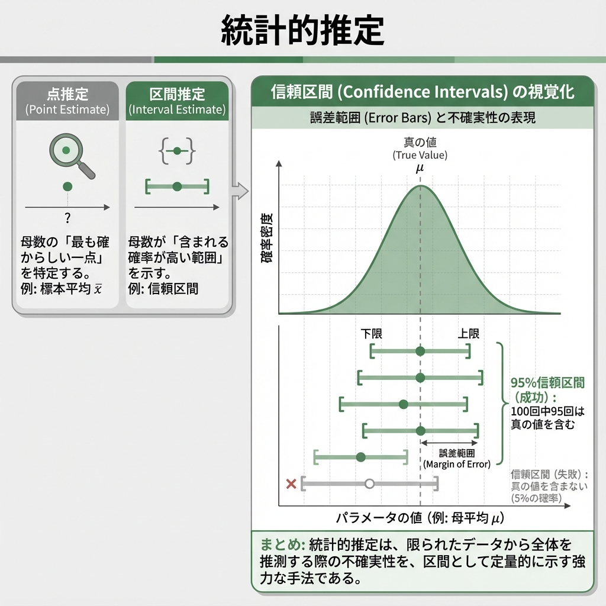

# 第8回 統計的推定 {.unnumbered}



## 「だいたい」を科学する

「有権者の支持率は45%」
「新薬の効果は従来より20%高い」

ニュースでよく聞く、これらの数字。もちろん、有権者全員に聞いたわけでも、世界中の患者に試したわけでもありません。
一部のデータ（標本）から、全体（母集団）の真実を推測したもの。

しかし、なぜ「45%」と言い切れるのか？
もし本当は「40%」だったら？ あるいは「50%」だったら？
その「ズレ」のリスクを、私たちはどう見積もればいいのか？

今回は、統計学の核心部分である**推定（Estimation）**について学びます。
一点張りで予想する「点推定」と、幅を持たせて安全策をとる「区間推定」。この2つの武器を使いこなしましょう。

## 1. 推定の基礎：レシピと料理

まず、言葉の定義をはっきりさせておきましょう。統計的推定には、似て非なる2つの用語が登場します。

1.  **推定量 (Estimator)**: 計算の**レシピ**（関数）。
    *   「データを全部足して人数で割る」という計算方法そのもの。確率的に変動します。
2.  **推定値 (Estimate)**: 実際に作られた**料理**（数値）。
    *   「平均値は50.3だった」という結果。確定した数値です。

### 良いレシピの条件

美味しい料理（正確な推定値）を作るためには、良いレシピ（優れた推定量）が必要。統計学では、以下の要素を重視します。

*   **不偏性**: 「平均的には」正解を指すこと。
*   **一致性**: データが増えれば増えるほど、正解に近づいていくこと。

## 2. 点推定：一点豪華主義

母数（知りたい真の値）を、たった一つの値で言い当てる方法です。
例えば、「日本の平均年収は450万円だ！」と言い切るのが点推定。

Tipsデータセットを使って、チップの支払総額の平均を点推定してみましょう。

```{python}
import pandas as pd

url = "https://raw.githubusercontent.com/mwaskom/seaborn-data/master/tips.csv"
tips = pd.read_csv(url)

# 点推定（標本平均）
tips["total_bill"].mean()
```

答えは `19.78594`。これが、現時点での私たちの「ベストな予想」。
しかし、これだけでは不十分です。「で、その予想はどれくらい信用できるの？」という問いに答えられないから。

## 3. 区間推定：輪投げのゲーム

そこで登場するのが**区間推定**。
「平均は19.78ドルです」と言う代わりに、「平均は18.66ドルから20.91ドルの間にある確率が高い」と、幅を持たせて答える。

これがいわゆる**信頼区間 (Confidence Interval)** です。

### 95%信頼区間の本当の意味

よくある誤解：「真の平均値がこの区間に入る確率は95%だ」
正しくは：「**この方法で輪投げ（区間推定）を100回やったら、そのうち95回は的（真の平均値）が入る**」

的（母数）は動きません。動くのは、私たちが投げる輪（信頼区間）のほう。

シミュレーションで、実際に輪投げを100回やってみましょう。

```{python}
import numpy as np
import pandas as pd
import matplotlib.pyplot as plt
from scipy.stats import t

rng = np.random.default_rng(123)

# ゲームの設定
n_sim = 100
n_sample = 30
mu = 50       # 的の位置（真の母平均）
sigma = 10    # 手ブレの大きさ（母標準偏差）
conf_level = 0.95
alpha = 1 - conf_level

rows = []
for i in range(1, n_sim + 1):
  # 1回の輪投げ（標本抽出）
  x = rng.normal(loc=mu, scale=sigma, size=n_sample)

  # 95%信頼区間（母分散未知 → t分布）
  xbar = x.mean()
  s = x.std(ddof=1)
  crit = t.ppf(1 - alpha / 2, df=n_sample - 1)
  half = crit * s / np.sqrt(n_sample)
  lower = xbar - half
  upper = xbar + half

  hit = (mu >= lower) and (mu <= upper)
  rows.append({"id": i, "lower": lower, "upper": upper, "hit": hit})

results = pd.DataFrame(rows)

# 結果発表
colors = results["hit"].map({True: "gray", False: "red"})
plt.vlines(results["id"], results["lower"], results["upper"], colors=colors, linewidth=2)
plt.axhline(mu, linestyle="--", color="black")
plt.title("95%信頼区間のシミュレーション (100回)")
plt.xlabel("試行回数")
plt.ylabel("区間推定の結果")
plt.figtext(0.5, 0.01, "赤色は的を外した失敗回", ha="center")
plt.show()
```

ご覧の通り、いくつかの赤い線（失敗）があります。
「95%信頼区間」とは、「長期的に見ればこれくらいの失敗率（5%）に収まるようなルールで区間を決めた」という保証書のようなもの。

## 4. t分布：不確実性のペナルティ

信頼区間を計算するとき、データ数が少ない場合は**t分布**という分布を使います。

これは「標準正規分布」によく似ていますが、少しだけ裾が広くなっています。
なぜか？

母分散（真のばらつき）がわからないため、代わりに標本から計算した不偏分散を使うからです。
「本当のばらつきがわからない」という不確実性の分だけ、区間（輪の大きさ）を少し広めにとって安全策をとる。それが、t分布の役割。

データ数（サンプルサイズ）が増えれば、この不確実性は減り、t分布は正規分布に近づいていく。

### Pythonで実践：平均の区間推定

母分散が未知のとき、平均の信頼区間は「標本平均 ± t臨界値 × 標準誤差」で計算できます。

```{python}
# 支払総額の95%信頼区間
import numpy as np
from scipy.stats import t

x = tips["total_bill"].to_numpy()
n = len(x)
xbar = x.mean()
s = x.std(ddof=1)
crit = t.ppf(0.975, df=n - 1)
half = crit * s / np.sqrt(n)
(xbar - half, xbar + half)
```

`95 percent confidence interval` の行を見てください。
これが、「今回の輪投げの結果」です。

### 信頼区間の幅を決める3要素

輪の大きさ（信頼区間の幅）は何で決まるのか？

1.  **信頼係数**: 「絶対に外したくない（99%）」と思えば、輪は大きくなる。
2.  **サンプルサイズ**: データが増えれば、的の位置がはっきり見えるので、輪は小さく（精度良く）なる。
3.  **ばらつき**: データが暴れている（分散が大きい）と、安全のために輪を大きくする必要がある。

```{python}
import numpy as np
import pandas as pd
from scipy.stats import t

def mean_ci(x, conf_level: float):
  x = np.asarray(x, dtype=float)
  n = len(x)
  xbar = x.mean()
  s = x.std(ddof=1)
  alpha = 1 - conf_level
  crit = t.ppf(1 - alpha / 2, df=n - 1)
  half = crit * s / np.sqrt(n)
  return xbar - half, xbar + half

levels = [0.90, 0.95, 0.99]
rows = []
for cl in levels:
  lo, hi = mean_ci(tips["total_bill"], cl)
  rows.append({"Confidence_Level": f"{int(cl * 100)}%", "Lower": lo, "Upper": hi})

pd.DataFrame(rows)
```

## 5. 母比率の区間推定

平均値だけでなく、「割合（比率）」も区間推定できます。
「内閣支持率は 45% ± 3%」といったニュースは、これを使っています。

例：100人中60人が賛成。母集団での賛成率は？

```{python}
from statsmodels.stats.proportion import proportion_confint

count = 60
nobs = 100
phat = count / nobs
ci = proportion_confint(count, nobs, alpha=0.05, method="wilson")  # スコア（Wilson）区間
{"p_hat": phat, "ci_95": ci}
```

## 課題

1.  **Tipsデータの分析**:
    `tips` データの `tip`（チップ額）について、平均値の99%信頼区間を求めてください。
2.  **解釈の確認**:
    算出された区間について、「チップの母平均が99%の確率でこの値になる」という説明がなぜ誤りなのか、論じてください。

## 練習問題

### 練習1: 信頼区間の幅とサンプルサイズ
記述統計的に同じ平均と分散を持つデータでも、サンプルサイズが異なると信頼区間はどう変わるか確認してください。
（`numpy.random.Generator.normal` で $n=10$ と $n=100$ のデータを生成し、t分布を用いた信頼区間の式で比較）

### 練習2: 母比率のシミュレーション
真の支持率が50%のとき、100人の世論調査を100回繰り返したと仮定し、95%信頼区間が0.5を含まない回数が何回あるかシミュレーションしてください。

### 練習3: 記述統計と推測統計
手元に $n=100$ のデータがあります。

- 「データの平均」と「母平均の点推定値」は値としては同じですが、概念としてどう異なりますか？

## まとめ

| 概念 | 説明 | Pythonでの実装例 |
|---|---|---|
| **推定量** | 計算のレシピ（関数）。 | - |
| **推定値** | 出来上がった料理（数値）。 | - |
| **信頼区間** | 輪投げの輪。的（母数）を捉える確率的範囲。 | `scipy.stats.t.ppf` + 式、`statsmodels.stats.proportion.proportion_confint` |
| **t分布** | データ不足の不確実性を考慮した、少し幅広の正規分布。 | `scipy.stats.t` |
