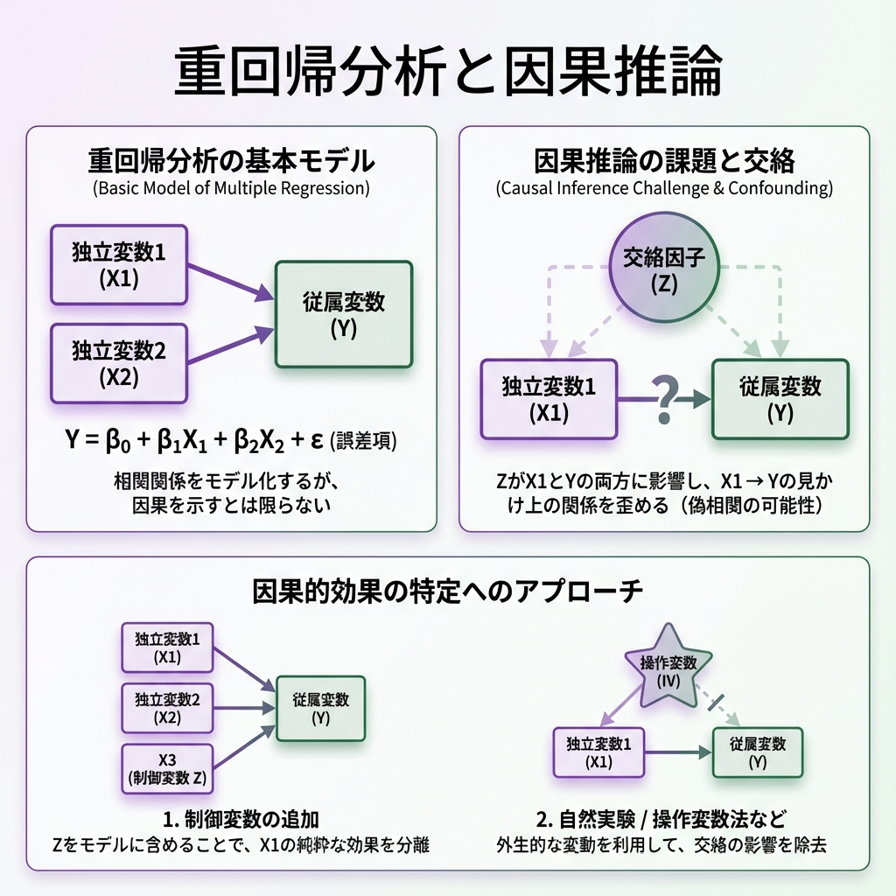

# 第12回 重回帰分析と因果推論 {.unnumbered}

## 複雑な現実を解き明かす

「勉強すれば成績は上がる」と言うが、成績に影響するのは勉強時間だけだろうか？
地頭の良さ、塾の有無、親の収入、睡眠時間……現実は無数の要因が絡み合っている。

たった一つの原因で結果が決まることなど、世の中にはほとんどない。
だからこそ、複数の要因を同時に扱う **重回帰分析** が必要になる。

今回は、絡み合った糸をほぐし、真の原因（因果関係）を見つけ出すための探偵技術を学ぼう。

## 1. 複数のツマミを操る：重回帰分析

データ分析を「ミキシングコンソール」の操作だと想像してほしい。
単回帰分析は「ボリューム」という一つのツマミしか持たなかった。
重回帰分析では、「ボリューム」「低音」「高音」など、複数のツマミ（説明変数）を同時に操作して、最適なサウンド（予測）を作り出す。

$$ \text{結果} \ (Y) = \text{切片} + (\beta_1 \times \text{要因1}) + (\beta_2 \times \text{要因2}) + \dots + \text{誤差} $$

### 「他を固定して」見る技術 (Ceteris Paribus)

重回帰分析の凄さは、**「他の条件が同じならば」** という仮定を数式の中で実現できる点にある。

例えば、チップ額 ($Y$) を支払額 ($X_1$) と客数 ($X_2$) で説明する場合：

係数 $\beta_1$ は、「**客数が同じグループの中で比べたとき**、支払額が1ドル増えるとチップはどうなるか」を表す。

あたかも実験室で条件を統制したかのように、純粋な効果を取り出せるのだ。

### 実践: 支払いと人数の分離

```{r}
library(tidyverse)
theme_set(theme_gray(base_family = "HiraKakuProN-W3"))
library(broom)
url <- "https://raw.githubusercontent.com/mwaskom/seaborn-data/master/tips.csv"
tips <- read_csv(url)

# 重回帰モデル：チップを「支払額」と「人数」で説明する
model_multi <- lm(tip ~ total_bill + size, data = tips)
summary(model_multi)
```

**解釈**:
-   `total_bill`: **0.093**
    -   「もし人数が同じなら」、支払いが1ドル増えるごとにチップは約9.3セント増える。
-   `size`: **0.193**
    -   「もし支払額が同じなら」、人数が1人増えるごとにチップは約19.3セント増える。

## 2. 実践的モデリング

現実は数値データだけではない。「性別」や「曜日」といった文字データ（カテゴリ変数）も分析に使える。

### ダミー変数：スイッチのON/OFF

「喫煙席か？」のような情報は、計算できるよう **0 (No)** と **1 (Yes)** に変換する。これをダミー変数と呼ぶ。

```{r}
# 喫煙者ダミー（Yes/No）を追加
model_dummy <- lm(tip ~ total_bill + size + smoker, data = tips)
tidy(model_dummy)
```

`smokerYes` の係数は、喫煙席に座ることで生じる「上乗せ分」を表す。

### 交互作用：「相乗効果」に気づく

「ビールと枝豆」のように、組み合わせることで効果が変わることもある。
例えば、「喫煙者の方が、支払額に対するチップの払いっぷりが良い（傾きが急）」かもしれない。

```{r}
# : は交互作用のみ、* は主効果＋交互作用
model_inter <- lm(tip ~ total_bill * smoker, data = tips)
summary(model_inter)
```

`total_bill:smokerYes` が有意なら、2つの要因には相乗効果（あるいは相殺効果）があると言える。

## 3. 真犯人を探せ：因果推論とバイアス

「相関関係があっても因果関係とは限らない」。耳にタコができるほど聞いた言葉だが、その正体は何だろうか？
最大の原因は、**交絡因子（こうらくいんし）** という「裏で糸を引く黒幕」の存在だ。

### 典型例：教育と賃金のミステリー

「高学歴な人は給料が高い」というデータがある。
しかし、これは純粋に教育のおかげだろうか？
もしかすると、「元々の能力が高い人」が「高学歴になりやすく」、かつ「給料も高い」だけかもしれない。

この「能力」こそが交絡因子だ。これを無視して分析すると、教育の効果を過大評価してしまう（**除外変数バイアス**）。

### シミュレーション：バイアスの除去

重回帰分析を使えば、この黒幕（交絡因子）を表舞台に引きずり出し、無力化できる。
ここでは、あえて「神様の視点」で真実のデータを作り出し、それを分析者が正しく見抜けるか実験してみよう。

```{r}
set.seed(123)
n <- 200

# 1. 神様の視点（データの生成）
ability <- rnorm(n, 100, 15) # 能力（黒幕）：平均100、標準偏差15でばらつく
education <- 12 + 0.05 * ability + rnorm(n, 0, 2) # 能力が高いと教育年数も長くなる傾向
wage <- 20 + 2 * education + 0.3 * ability + rnorm(n, 0, 5) # 賃金は教育と能力の両方で決まる

sim_data <- tibble(wage, education, ability)

# 2. 失敗：黒幕（能力）を無視してしまう
# 教育の係数が過大に評価される（本当は2.0なのに……）
lm(wage ~ education, data = sim_data) %>% coef()

# 3. 成功：黒幕をモデルに入れてコントロール（統制）する
# 教育の係数が真の値（2.0）に近づく！
lm(wage ~ education + ability, data = sim_data) %>% coef()
```

能力をモデルに加える（コントロールする）ことで、教育が賃金に与える純粋な効果（係数）は、真の値である **2.0** に近づいた。
重回帰分析は、単なる予測ツールではない。変数を適切に選ぶことで、偏りのない **因果推論** を行うための強力な武器になるのだ。

## 4. 良いモデルの選び方

変数を増やせば増やすほどモデルは現実に合致していくが、やりすぎは禁物。

### 多重共線性（マルチコ）：似た者同士の喧嘩

似たような変数（例：身長と座高）を両方入れると、お互いが邪魔をし合って、係数の推定がおかしくなる。
**VIF** という指標チェックし、10を超えていたら要注意。

```{r}
library(car)
vif(model_multi)
```

### 調整済み決定係数：シンプルさへのボーナス

通常の決定係数 $R^2$ は、無駄な変数を足しても増えてしまうという欠点がある。
そこで、「変数の数」が増えることにペナルティを課した **調整済み決定係数 (Adjusted $R^2$)** を使おう。
この値が大きいほど、バランスの良い優れたモデルと言える。

```{r}
# 調整済み決定係数 (Adjusted R-squared) を比較してみよう
model_simple <- lm(tip ~ total_bill, data = tips) # 前回の単回帰モデル

# それぞれのモデルの「成績表」から数値を取り出す
summary(model_simple)$adj.r.squared
summary(model_multi)$adj.r.squared
summary(model_dummy)$adj.r.squared
```

モデルが複雑になるにつれて、値が改善しているのがわかるはずだ。
（※より高度な基準として AIC や BIC もあるが、まずはこれを羅針盤にしよう）

## 係数の可視化

数字の羅列を見るよりも、グラフで可視化したほうが直感的に理解できる。

```{r}
theme_set(theme_gray()) # [対象注意] Mac用設定

tidy(model_dummy, conf.int = TRUE) %>%
  filter(term != "(Intercept)") %>%
  ggplot(aes(x = estimate, y = term)) +
  theme_gray() + # [対象注意] Mac用設定
  geom_point() +
  geom_errorbarh(aes(xmin = conf.low, xmax = conf.high), height = 0.2) +
  geom_vline(xintercept = 0, color = "red", linetype = "dashed") +
  labs(title = "重回帰分析の係数プロット")
```

## 最終課題

自分の興味のあるデータセットを見つけ、分析レポートを作成してください。
データセットの例：
- `mpg` (自動車の燃費データ: `ggplot2` パッケージに同梱)
- `diamonds` (ダイヤモンドの価格データ: `ggplot2` パッケージに同梱)
- `palmerpenguins` (ペンギンの身体測定データ: 要パッケージインストール)

**レポート構成案**:

1.  **問いの設定**: 何を明らかにしたいか（例：ダイヤモンドの価格を決めるのはカラット数か、透明度か？）
2.  **データの可視化**: ヒストグラムや散布図でデータを「見る」。
3.  **モデリング**: 重回帰モデルを構築し、係数を推定する。
4.  **結果の解釈**: 「他の条件を一定としたとき」、その変数は結果にどう影響しているか？を言葉で説明する。

## 講義のまとめ

本講義では、データの読み込みから可視化、基本的な統計的推測、そして回帰分析による因果へのアプローチまでを学びました。
これらはデータサイエンスの基礎体力となるスキルです。
さらに深く学びたい方は、計量経済学や機械学習のコースへ進むことを推奨します。

## 練習問題

1.  **モデル選択の実践**: `mtcars` データセットにおいて、燃費 (`mpg`) を説明する最適な変数の組み合わせを、調整済み $R^2$ や AIC を用いて探してください。
2.  **交互作用の解釈**: 先ほどの喫煙者と支払額の交互作用モデルについて、具体的な数値を用いて、「喫煙者なら10ドル増えるごとにチップはどう変わるか」を説明してください。
3.  **交絡の発見**: あなたの身の回りで「相関はあるが因果ではない（共通の原因がある）」と思われる例を挙げ、因果図を描いて説明してください。
